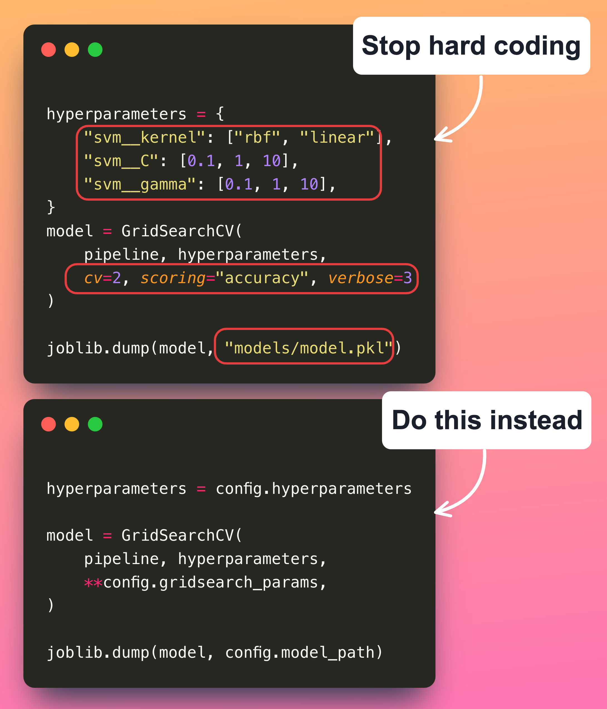

<div align="center">
<h1 align="center">
Demo for Stop Hard Coding in a Data Science Project - Use Configuration Files Instead
</h3>

[](https://mathdatasimplified.com/stop-hard-coding-in-a-data-science-project-use-configuration-files-instead/)
  


</div>

## Set up the environment

1. Install [Poetry](https://python-poetry.org/docs/#installation)
1. Activate the virtual environment:

```bash
poetry shell
```

1. Set up the environment:

```bash
make environment
```
